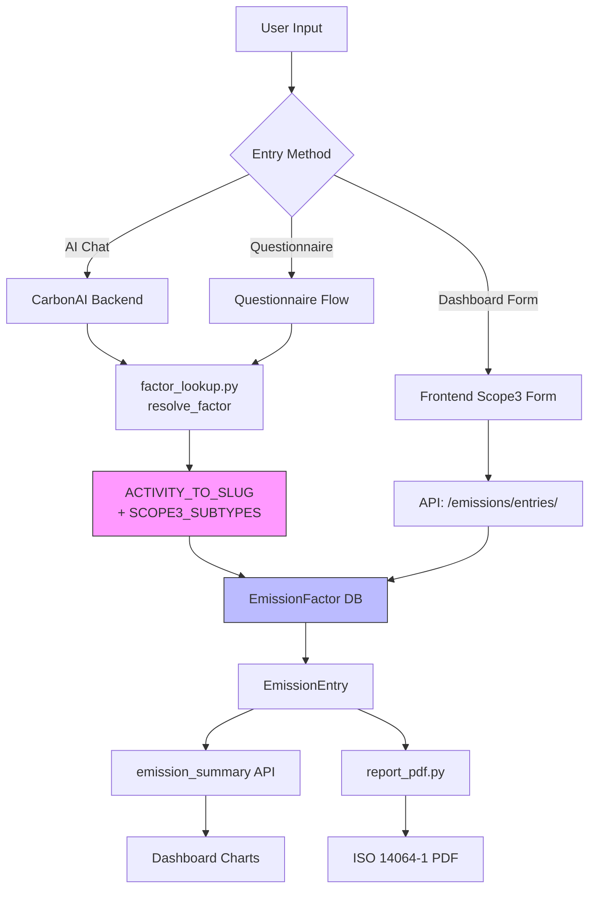

# Design Document: Scope 3 Full Categories

## Overview

This feature extends the Carbonless platform to fully support all 15 GHG Protocol Scope 3 emission categories across the entire stack: backend factor resolution, seed data, AI chat, frontend entry forms, and ISO 14064-1 PDF reporting. The design preserves the existing `ACTIVITY_TO_SLUG` architecture — a single deterministic mapping of `(activity_type, unit)` pairs to EmissionFactor slugs — while expanding it from ~22 entries to ~65+ entries covering every Scope 3 sub-type.

**Key Design Decisions:**
1. **Extend, don't replace**: The existing `ACTIVITY_TO_SLUG` pattern works well. We add new entries rather than changing the resolution mechanism.
2. **Sub-type routing via compound keys**: Each Scope 3 category has its own top-level `activity_type` (e.g., `purchased_goods`, `waste`), with sub-types encoded as separate `(activity_type_subtype, unit)` entries OR via a helper function that composes the slug from `activity_type + sub_type`.
3. **Category metadata registry**: A new `SCOPE3_CATEGORIES` dictionary centralizes category metadata (GHG Protocol number, valid sub-types, units, labels) for use by the frontend, AI chat, and report generator.
4. **No data model changes**: The existing `EmissionFactor` and `EmissionEntry` models already support all needed fields. The `CATEGORY_CHOICES` needs two additions: `processing_sold` and `use_of_sold` (the seed_data already uses `processing_of_sold_products` and `use_of_sold_products` — these must be normalized).

## Architecture



### Component Interaction Flow

1. **Factor Resolution** (factor_lookup.py): Maps `(activity_type, unit)` → slug → EmissionFactor (Turkey-first fallback)
2. **Seed Data** (seed_data.py): Pre-populates EmissionFactor table with all 15 categories
3. **AI Chat** (chat/views.py): Uses `get_emission_factor_reference()` for RAG context, calls `create_entry_from_activity()`
4. **Frontend** (Next.js): New Scope3EntryForm component with cascading selectors
5. **Report PDF** (report_pdf.py): Groups Scope 3 by GHG Protocol category number (1–15)

## Components and Interfaces

### 1. Backend: Category Metadata Registry (NEW)

**File**: `emissions/scope3_categories.py`

A centralized registry that both the backend and API expose for frontend consumption:

```python
SCOPE3_CATEGORIES = {
    'purchased_goods': {
        'ghg_number': 1,
        'name_en': 'Purchased Goods & Services',
        'name_tr': 'Satın Alınan Mallar ve Hizmetler',
        'subtypes': {
            'electrical_large': {'unit': 'kg', 'slug': 'electrical-large'},
            'electrical_small': {'unit': 'kg', 'slug': 'electrical-small'},
            'electrical_it': {'unit': 'kg', 'slug': 'electrical-it'},
            'glass': {'unit': 'kg', 'slug': 'glass'},
            'metal_aluminium': {'unit': 'kg', 'slug': 'metal-aluminium'},
            'metal_steel': {'unit': 'kg', 'slug': 'metal-steel-cans'},
            'paper_mixed': {'unit': 'kg', 'slug': 'paper-mixed'},
            'plastic_average': {'unit': 'kg', 'slug': 'plastic-average'},
            'plastic_hdpe': {'unit': 'kg', 'slug': 'plastic-hdpe'},
            'wood': {'unit': 'kg', 'slug': 'wood'},
            'chemical': {'unit': 'kg', 'slug': 'chemical'},
            'mineral_oil': {'unit': 'kg', 'slug': 'mineral-oil'},
        }
    },
    'capital_goods': {
        'ghg_number': 2,
        'name_en': 'Capital Goods',
        'name_tr': 'Sermaye Malları',
        'subtypes': {
            'machinery': {'unit': 'units', 'slug': 'machinery'},
            'vehicles': {'unit': 'units', 'slug': 'vehicles'},
            'buildings': {'unit': 'm2', 'slug': 'buildings'},
            'it_equipment': {'unit': 'units', 'slug': 'it-equipment'},
        }
    },
    # ... all 15 categories follow this pattern
}
```

### 2. Backend: Extended ACTIVITY_TO_SLUG (MODIFIED)

**File**: `emissions/factor_lookup.py`

New entries added for all Scope 3 sub-types. The key pattern is `(category_subtype, unit)`:

```python
# Purchased Goods (Cat 1)
('purchased_goods_electrical_large', 'kg'): 'electrical-large',
('purchased_goods_electrical_small', 'kg'): 'electrical-small',
('purchased_goods_glass', 'kg'): 'glass',
# ... etc.

# Waste (Cat 5)
('waste_landfill', 'kg'): 'general-landfill',
('waste_recyclable', 'kg'): 'recyclable',
('waste_organic_compost', 'kg'): 'organic-compost',
('waste_incineration', 'kg'): 'incineration',

# Employee Commuting (Cat 7)
('employee_commuting_car_commute', 'km'): 'car-commute',
('employee_commuting_bus_commute', 'km'): 'bus-commute',
# ... etc.
```

A helper function `resolve_scope3_activity(category, subtype, unit)` will compose the activity_type key and delegate to `resolve_factor()`.

### 3. Backend: Updated Seed Data (MODIFIED)

**File**: `emissions/seed_data.py`

The seed data already includes entries for most categories. Missing categories to add:
- `processing_sold` (Category 10) — already present as `processing_of_sold_products`
- `use_of_sold` (Category 11) — already present as `use_of_sold_products`
- `downstream_leased` (Category 13) — already present

**Category name normalization needed**: The `CATEGORY_CHOICES` in `models.py` must be updated to include `processing_sold` and `use_of_sold`, and seed data entries must use these normalized keys.

### 4. Backend: API Endpoint for Scope 3 Metadata (NEW)

**File**: `emissions/views.py`

New endpoint: `GET /api/emissions/scope3-categories/`

Returns the category registry for frontend consumption:
```json
{
  "categories": [
    {
      "key": "purchased_goods",
      "ghg_number": 1,
      "name_en": "Purchased Goods & Services",
      "name_tr": "Satın Alınan Mallar ve Hizmetler",
      "subtypes": [
        {"key": "electrical_large", "unit": "kg", "name_en": "Large Electrical Items", "name_tr": "Büyük Elektrikli Ürünler"},
        ...
      ]
    },
    ...
  ]
}
```

### 5. Backend: AI Chat Context Update (MODIFIED)

**File**: `emissions/factor_lookup.py` → `get_emission_factor_reference()`

The existing function iterates `ACTIVITY_TO_SLUG` and builds a RAG context block. Since we're adding all new entries to `ACTIVITY_TO_SLUG`, the RAG context auto-expands. Additionally, the system prompt in `chat/views.py` needs a Scope 3 category listing so the LLM can map natural-language descriptions to the correct `activity_type`.

### 6. Frontend: Scope 3 Entry Form Component (NEW)

**File**: `nexus_insights-saas-neon_nextjs/src/components/dashboard/Scope3EntryForm.jsx`

A cascading form component:
1. **Category Selector** — Dropdown of all 15 Scope 3 categories (bilingual)
2. **Sub-type Selector** — Dynamic list based on selected category
3. **Quantity Input** — With the correct unit label for the selected sub-type
4. **Submit** — Calls `POST /api/emissions/entries/` with resolved factor

```jsx
// Component hierarchy
<Scope3EntryForm>
  <CategorySelect categories={scope3Categories} />
  <SubtypeSelect subtypes={selectedCategory.subtypes} />
  <QuantityInput unit={selectedSubtype.unit} />
  <SubmitButton />
</Scope3EntryForm>
```

### 7. Frontend: Translations Update (MODIFIED)

**File**: `nexus_insights-saas-neon_nextjs/src/lib/i18n/translations.js`

Add `scope3` key with all category names and sub-type labels in both EN and TR.

### 8. Backend: Report PDF Update (MODIFIED)

**File**: `emissions/report_pdf.py`

Update the Category Analysis section (Section 3) to:
- Group Scope 3 entries by GHG Protocol category number
- Display all 15 categories (including zeros for completeness)
- Show both English and Turkish category names
- Add a dedicated "Scope 3 Category Breakdown" sub-section

### 9. Backend: Model Update (MODIFIED)

**File**: `emissions/models.py`

Add missing `CATEGORY_CHOICES`:
```python
('processing_sold', 'Processing of Sold Products'),
('use_of_sold', 'Use of Sold Products'),
```

Update seed data to use these normalized category keys instead of `processing_of_sold_products` and `use_of_sold_products`.

## Data Models

### EmissionFactor (Existing — No Schema Changes)

The existing model already supports all required fields:
- `slug` — unique key for factor lookup
- `scope` — 'scope3' for all new entries
- `category` — one of the 15+2 category values
- `country` — 'global' or 'turkey'
- `unit` — extended UNIT_CHOICES already covers all needed units
- `factor_kg_co2e` — the emission factor value

### CATEGORY_CHOICES Update

```python
CATEGORY_CHOICES = [
    # Scope 1 (unchanged)
    ('stationary_combustion', 'Stationary Combustion'),
    ('mobile_combustion', 'Mobile Combustion'),
    ('fugitive_emissions', 'Fugitive Emissions'),
    # Scope 2 (unchanged)
    ('electricity', 'Electricity'),
    ('steam_heat', 'Steam & Heat'),
    # Scope 3 — all 15 GHG Protocol categories + water + custom
    ('purchased_goods', 'Purchased Goods & Services'),       # Cat 1
    ('capital_goods', 'Capital Goods'),                       # Cat 2
    ('fuel_energy', 'Fuel & Energy Related'),                 # Cat 3
    ('upstream_transport', 'Upstream Transportation'),         # Cat 4
    ('waste', 'Waste Generated'),                             # Cat 5
    ('business_travel', 'Business Travel'),                   # Cat 6
    ('employee_commuting', 'Employee Commuting'),             # Cat 7
    ('upstream_leased', 'Upstream Leased Assets'),            # Cat 8
    ('downstream_transport', 'Downstream Transportation'),    # Cat 9
    ('processing_sold', 'Processing of Sold Products'),       # Cat 10 (NEW)
    ('use_of_sold', 'Use of Sold Products'),                  # Cat 11 (NEW)
    ('end_of_life', 'End-of-Life Treatment'),                 # Cat 12
    ('downstream_leased', 'Downstream Leased Assets'),        # Cat 13
    ('franchises', 'Franchises'),                             # Cat 14
    ('investments', 'Investments'),                            # Cat 15
    ('water', 'Water'),
    ('custom', 'Custom'),
]
```

### Scope 3 Category to GHG Protocol Number Mapping

```python
SCOPE3_GHG_NUMBER = {
    'purchased_goods': 1,
    'capital_goods': 2,
    'fuel_energy': 3,
    'upstream_transport': 4,
    'waste': 5,
    'business_travel': 6,
    'employee_commuting': 7,
    'upstream_leased': 8,
    'downstream_transport': 9,
    'processing_sold': 10,
    'use_of_sold': 11,
    'end_of_life': 12,
    'downstream_leased': 13,
    'franchises': 14,
    'investments': 15,
}
```

### New ACTIVITY_TO_SLUG Entries (Complete List)

```python
# Purchased Goods (Cat 1)
('purchased_goods_electrical_large', 'kg'): 'electrical-large',
('purchased_goods_electrical_small', 'kg'): 'electrical-small',
('purchased_goods_electrical_it', 'kg'): 'electrical-it',
('purchased_goods_glass', 'kg'): 'glass',
('purchased_goods_metal_aluminium', 'kg'): 'metal-aluminium',
('purchased_goods_metal_steel', 'kg'): 'metal-steel-cans',
('purchased_goods_paper_mixed', 'kg'): 'paper-mixed',
('purchased_goods_plastic_average', 'kg'): 'plastic-average',
('purchased_goods_plastic_hdpe', 'kg'): 'plastic-hdpe',
('purchased_goods_wood', 'kg'): 'wood',
('purchased_goods_chemical', 'kg'): 'chemical',
('purchased_goods_mineral_oil', 'kg'): 'mineral-oil',

# Capital Goods (Cat 2)
('capital_goods_machinery', 'units'): 'machinery',
('capital_goods_vehicles', 'units'): 'vehicles',
('capital_goods_buildings', 'm2'): 'buildings',
('capital_goods_it_equipment', 'units'): 'it-equipment',

# Fuel & Energy (Cat 3)
('fuel_energy_upstream_electricity', 'kwh'): 'upstream-electricity',
('fuel_energy_transmission_losses', 'kwh'): 'transmission-losses',
('fuel_energy_fuel_extraction', 'liters'): 'fuel-extraction',

# Waste (Cat 5)
('waste_landfill', 'kg'): 'general-landfill',
('waste_recyclable', 'kg'): 'recyclable',
('waste_organic_compost', 'kg'): 'organic-compost',
('waste_incineration', 'kg'): 'incineration',

# Employee Commuting (Cat 7)
('employee_commuting_car_commute', 'km'): 'car-commute',
('employee_commuting_bus_commute', 'km'): 'bus-commute',
('employee_commuting_train_commute', 'km'): 'train-commute',
('employee_commuting_motorcycle_commute', 'km'): 'motorcycle-commute',
('employee_commuting_bicycle_commute', 'km'): 'bicycle-commute',

# Upstream Leased (Cat 8)
('upstream_leased_office_space', 'm2'): 'office-space',
('upstream_leased_warehouse', 'm2'): 'warehouse',
('upstream_leased_leased_vehicles', 'units'): 'leased-vehicles',

# Downstream Transport (Cat 9)
('downstream_transport_truck_delivery', 'tonne-km'): 'truck-delivery',
('downstream_transport_courier', 'packages'): 'courier',
('downstream_transport_postal', 'packages'): 'postal',

# Processing of Sold Products (Cat 10)
('processing_sold_energy_intensive', 'kg'): 'processing-energy-intensive',
('processing_sold_light', 'kg'): 'processing-light',
('processing_sold_chemical', 'kg'): 'processing-chemical',

# Use of Sold Products (Cat 11)
('use_of_sold_electricity', 'kwh'): 'product-electricity-use',
('use_of_sold_fuel', 'liters'): 'product-fuel-use',
('use_of_sold_gas', 'gj'): 'product-gas-use',

# End of Life (Cat 12)
('end_of_life_product_recycling', 'kg'): 'product-recycling',
('end_of_life_product_landfill', 'kg'): 'product-landfill',
('end_of_life_product_incineration', 'kg'): 'product-incineration',

# Downstream Leased (Cat 13)
('downstream_leased_leased_building', 'm2'): 'leased-building-downstream',
('downstream_leased_leased_equipment', 'units'): 'leased-equipment-downstream',

# Franchises (Cat 14)
('franchises', 'franchises'): 'franchise-operations',

# Investments (Cat 15)
('investments_equity_investments', 'usd'): 'equity-investments',
('investments_debt_investments', 'usd'): 'debt-investments',

# Water
('water_water_supply', 'm3'): 'water-supply',
('water_water_treatment', 'm3'): 'water-treatment',
```

## Correctness Properties

*A property is a characteristic or behavior that should hold true across all valid executions of a system — essentially, a formal statement about what the system should do. Properties serve as the bridge between human-readable specifications and machine-verifiable correctness guarantees.*

### Property 1: Valid Scope 3 activity resolution always succeeds

*For any* valid `(category, subtype, unit)` triple defined in `SCOPE3_CATEGORIES`, calling `resolve_scope3_activity(category, subtype, quantity, unit)` with a positive quantity SHALL return a non-null EmissionFactor and a calculated CO2e value equal to `quantity * factor.factor_kg_co2e`.

**Validates: Requirements 1.1, 2.1, 3.1, 4.1, 5.1, 6.1, 7.1, 8.1, 9.1, 10.1, 11.1, 13.1, 18.1**

### Property 2: Invalid sub-type returns descriptive error with supported list

*For any* Scope 3 category and *any* string that is NOT a valid sub-type for that category, calling `resolve_scope3_activity` SHALL return an error message that contains at least one of the valid sub-types for that category.

**Validates: Requirements 1.3, 3.3, 4.4, 5.4, 7.3, 9.3, 10.3, 11.3, 13.3, 18.4**

### Property 3: Unit mismatch returns error with correct unit

*For any* valid `(category, subtype)` pair and *any* unit string that does NOT match the expected unit for that sub-type, calling `resolve_scope3_activity` SHALL return an error message that contains the correct unit for that sub-type.

**Validates: Requirements 2.3, 6.3, 12.3**

### Property 4: Turkey-specific factors are preferred over global

*For any* activity slug that has both a Turkey-specific and a global EmissionFactor in the database, `resolve_factor` SHALL return the Turkey-specific factor (country='turkey').

**Validates: Requirements 4.3, 18.3**

### Property 5: Frontend category-subtype filtering matches registry

*For any* Scope 3 category selected in the UI, the displayed sub-type list SHALL exactly match the sub-types defined in `SCOPE3_CATEGORIES` for that category, and each sub-type's displayed unit label SHALL match the unit defined in the registry.

**Validates: Requirements 15.2, 15.3**

### Property 6: Bilingual translations are complete for all categories and sub-types

*For any* `(category, subtype)` pair defined in `SCOPE3_CATEGORIES`, both the English (`name_en`) and Turkish (`name_tr`) translation strings SHALL exist and be non-empty.

**Validates: Requirements 15.4, 19.3**

### Property 7: Seed data covers all 15 Scope 3 categories

*For any* category key in the `SCOPE3_GHG_NUMBER` mapping (all 15 Scope 3 categories), at least one entry in `EMISSION_FACTORS` seed data SHALL have that category value.

**Validates: Requirements 17.1**

### Property 8: CO2e calculation is non-negative for valid inputs

*For any* valid Scope 3 activity with a positive quantity, the calculated `co2e_kg` SHALL be greater than or equal to zero (accounting for zero-emission activities like bicycle commuting).

**Validates: Requirements 1.1, 5.3**

## Error Handling

### Factor Resolution Errors

| Error Scenario | Response | HTTP Status |
|---|---|---|
| Unknown category | `"'{category}' is not a supported Scope 3 category."` | 400 |
| Unknown sub-type for valid category | `"No registered sub-type '{subtype}' for category '{category}'. Supported: [list]"` | 400 |
| Unit mismatch | `"Unit '{unit}' not valid for '{subtype}'. Expected: '{expected_unit}'"` | 400 |
| No DB factor for valid slug | `"No active emission factor found for '{activity_type}' ({unit})."` | 404 |
| Negative quantity | `"Quantity must be greater than zero."` | 400 |
| Invalid quantity (non-numeric) | `"Invalid quantity: {value}."` | 400 |

### AI Chat Error Handling

- When the LLM cannot determine category: ask clarifying question with category list
- When the LLM cannot determine sub-type: ask clarifying question with sub-type list for the identified category
- When activity_type produced by LLM is not in ACTIVITY_TO_SLUG: return graceful error suggesting the user try the manual entry form

### Frontend Error Handling

- API call failures: display error toast with retry option
- Missing translations: fall back to English labels
- Empty category/sub-type list from API: display loading skeleton, retry with exponential backoff

### Seed Data Error Handling

- Duplicate slug+country+year: use `update_or_create` to handle re-seeding gracefully
- Missing required fields in seed entry: `validate_emission_factors()` catches before DB write
- Invalid category value: Django model validation rejects on save

## Testing Strategy

### Property-Based Tests (Hypothesis — Python)

Property-based testing is appropriate for this feature because:
- The factor resolution logic is a pure function with clear input/output behavior
- There are universal properties that hold across a wide range of inputs (any valid category/subtype/unit triple)
- The input space is large (15 categories × multiple sub-types × continuous quantity values)

**Library**: [Hypothesis](https://hypothesis.readthedocs.io/) for Python backend tests

**Configuration**: Minimum 100 iterations per property test

Each property test MUST be tagged with a comment referencing the design property:
```python
# Feature: scope3-full-categories, Property 1: Valid Scope 3 activity resolution always succeeds
```

**Property tests to implement:**
1. Property 1: Resolution success for all valid triples
2. Property 2: Invalid sub-type error includes supported list
3. Property 3: Unit mismatch error includes correct unit
4. Property 4: Turkey preference over global
5. Property 7: Seed data completeness
6. Property 8: Non-negative CO2e for valid inputs

### Unit Tests (pytest)

- Verify each specific sub-type resolves to its expected slug (enumeration tests per Requirements 1.2, 2.2, 3.2, 4.2, 5.2, 6.2, 7.2, 9.2, 10.2, 11.2, 12.1, 12.2, 13.2, 18.2)
- Bicycle commute yields exactly 0.0 CO2e (Requirement 5.3)
- Franchise activity resolves to "franchise-operations" slug
- `get_emission_factor_reference()` includes all 15 categories in output
- Report generator includes all 15 categories with zero values when no entries exist
- Translation file has entries for all categories and sub-types

### Integration Tests

- AI Chat correctly parses representative Scope 3 descriptions (EN + TR)
- Frontend form submit sends correct API payload
- Seed command populates all 15 categories without errors
- PDF report generates with Scope 3 breakdown section
- Dashboard summary API returns Scope 3 by-category breakdown

### Frontend Tests (Jest + React Testing Library)

- Property 5: Category selection filters sub-types correctly
- Property 6: All labels have non-empty translations in both languages
- Scope3EntryForm renders all 15 categories
- Sub-type selector updates when category changes
- Unit label updates when sub-type changes

